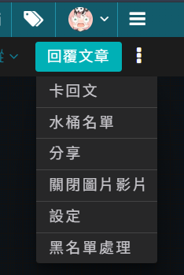
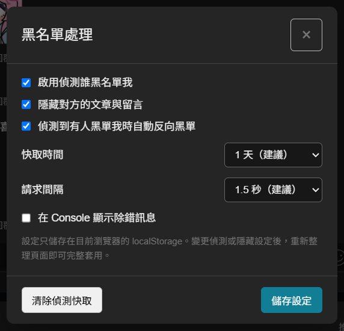

# 巴哈黑名單偵測

用於巴哈姆特哈啦區文章頁面的 Tampermonkey userscript，可偵測哪些使用者已將你加入黑名單。

## 功能

- 偵測文章樓層與留言中的使用者是否將你加入黑名單
- 在帳號旁顯示「已偵測到將你黑單」標籤，並附上首次偵測到的時間（滑鼠停留可看最後確認時間）
- 可選擇隱藏對方的文章與留言
- 可在偵測後自動將對方加入自己的黑名單
- 從巴哈頁面右上角的「更多」選單開啟設定，不必修改程式碼
- 使用瀏覽器 `localStorage` 保存設定與偵測快取
- 提供固定且安全的請求間隔，避免短時間發送過多請求
- 未登入時自動停用偵測，不發送無效請求或寫入錯誤快取
- 支援 AJAX 動態載入的新留言

## 使用方式

### 開啟黑名單處理

在巴哈文章頁面右上角打開「更多」選單，點選「黑名單處理」。

### 調整偵測設定

可在設定面板啟用偵測、隱藏文章與留言、自動反向黑單，並選擇快取時間及安全的請求間隔。

## 安裝

1. 安裝 [Tampermonkey](https://www.tampermonkey.net/)。
2. [點此安裝 userscript](https://raw.githubusercontent.com/udeyubi/bahamut-blacklist-detector/main/baha-blacklist-detector.user.js)。
3. 開啟巴哈姆特哈啦區文章頁面。
4. 從頁面右上角的「更多」選單選擇「黑名單處理」。

## 使用提醒

- 必須先登入巴哈姆特才能進行偵測。
- 偵測結果預設會快取一天，可在設定中調整或手動清除。
- 網站改版可能導致頁面元素或偵測方式失效。

## 更新紀錄

### 1.0.8（2026-10-03）

- 修正：頁面往下捲後出現的固定標題列，其「⋮」選單裡沒有「黑名單處理」。現在頁首與固定標題列兩個選單都會加入。

### 1.0.7（2026-10-02）

- 修正：偵測到留言者將你黑單時，標籤會誤貼到該樓樓主的帳號旁，造成樓主被誤認為黑單你。現在標籤會正確顯示在留言者旁邊。
- 新增：標籤顯示首次偵測到黑單的時間（例如「已偵測到將你黑單 · 2026/10/02 23:28」），滑鼠停留可看首次偵測與最後確認時間。快取過期重新偵測時，會保留首次偵測時間。
- 提醒：開啟「隱藏對方的文章與留言」時，黑單你的留言會直接隱藏，因此不會看到留言上的標籤；想看標籤請在設定中關閉隱藏。

## 作者

[@udeyubi](https://github.com/udeyubi)
